# TP5 - BBDD, SQL, Manejo de Versiones y Reporting
# 16.22 Informática Médica
## Integrantes del Grupo 7

- Martin Gatti - 59712
- Florencia Peydro - 59105

## Profesores

- Carlos Lazzarino
- Ingrid Spessotti
- Eugenia Camila Berrino
- Melina Piacentino Castaño

**Fecha De Entrega: 23/10/2024**

## **PARTE 1:** Bases de Datos

Utilizando la base de datos de un centro médico que utilizamos a lo largo de las clases y la información brindada por el enunciado (la cual se muestra a continuación), se procedió a resolver las consignas.

### Entidades: 
- **Pacientes**: Registra información detallada sobre los pacientes, incluyendo nombre, fecha de nacimiento y dirección.
- **Médicos**: Almacena detalles sobre los médicos que brindan atención médica, como nombre y especialidad.
- **Medicamentos**: Contiene una lista de medicamentos disponibles con detalles sobre dosis y administración.
- **Consultas**: Registra todas las consultas médicas realizadas, incluyendo fecha, médico y paciente involucrados, y diagnóstico.
- **Recetas**: Vincula pacientes con medicamentos prescritos por los médicos, incluyendo información sobre el medicamento, cantidad y frecuencia.

### Consignas:

1. **¿Qué tipo de base de datos es? Clasificarla según estructura y función.**

La base de datos del centro médico puede clasificarse como una base de datos relacional, ya que se usan tablas relacionadas entre sí mediante claves primarias (_primary keys o PK_) y claves foráneas (_foreign keys o FK_) para almacenar datos de diferentes entidades como pacientes, médicos, recetas, medicamentos y consultas. En cuanto a la función, el principal objetivo es gestionar transacciones en tiempo real, como el registro de consultas, la emisión de recetas y la actualización de datos de pacientes y médicos.

2. **Armar el diagrama entidad-relación de la base de datos dada.**

A continuación presentamos las entidades con sus atributos y relaciones:

- **Pacientes**
  - `id_paciente` (PK)
  - `nombre`
  - `fecha_nacimiento`
  - `dirección`

- **Médicos**
  - `id_médico` (PK)
  - `nombre`
  - `especialidad`

- **Medicamentos**
  - `id_medicamento` (PK)
  - `nombre`
  - `dosis`

- **Consultas**
  - `id_consulta` (PK)
  - `fecha`
  - `diagnostico`
  - `id_médico` (FK)
  - `id_paciente` (FK)

- **Recetas**
  - `id_receta` (PK)
  - `cantidad`
  - `frecuencia`
  - `id_paciente` (FK)
  - `id_médico` (FK)
  - `id_medicamento` (FK)

**Relaciones:**
- Una consulta está vinculada a un solo paciente, pero un paciente puede tener muchas consultas. Relación 1 a muchos (N).
- Una receta está vinculada a un solo paciente, pero un paciente puede recibir muchas recetas. Relación 1 a muchos (N).
- Una consulta está vinculada a un solo médico, pero un médico puede realizar muchas consultas. Relación 1 a muchos (N).
- Una receta está vinculada a un solo médico, pero un médico puede emitir muchas recetas. Relación 1 a muchos (N).
- Una receta contiene un solo medicamento, pero un medicamento puede estar presente en muchas recetas. Relación 1 a muchos (N).
- Una consulta médica puede generar varias recetas, pero cada receta está vinculada a una sola consulta. Relación 1 a muchos (N).

A partir de la definición de las entidades con sus atributos y las relaciones que mencionamos anteriormente armamos el diagrama entidad-relación que se puede ver a continuación:

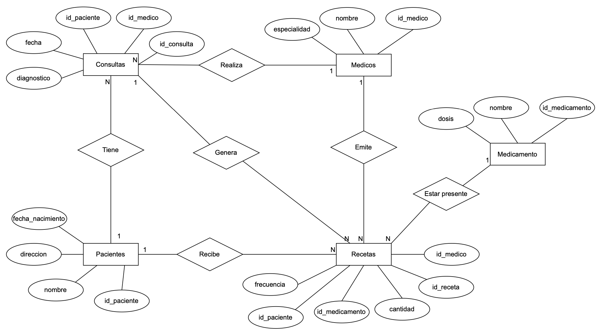

3. **Armar el Modelo relacional de la base de datos dada.**

En base a las entidades y relaciones del ítem pasado, armamos el modelo relacional de la base de datos.

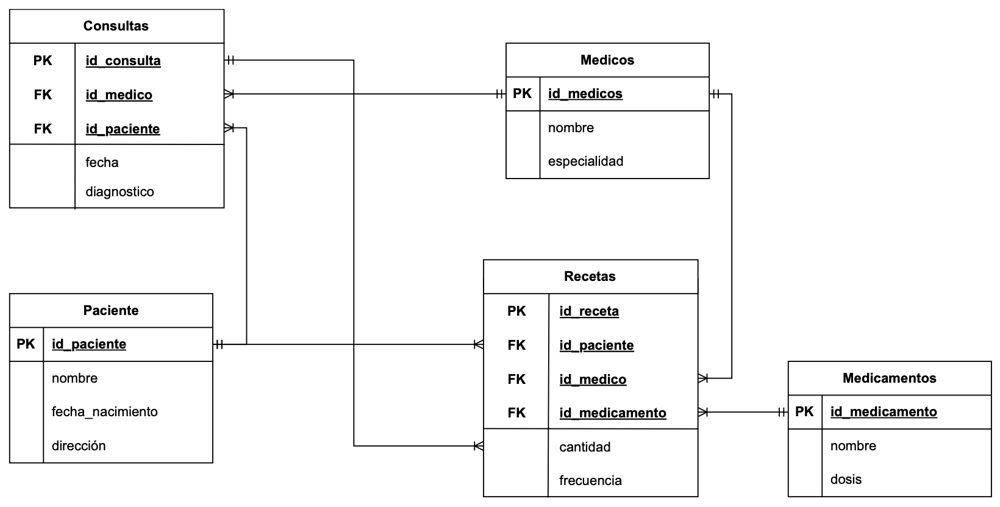

4. **¿Considera que la base de datos está normalizada? En caso que no lo esté, ¿cómo podría hacerlo?**

La normalización es el proceso de estructurar una base de datos de acuerdo con una serie de reglas para minimizar la redundancia de datos y mejorar la integridad de los datos. Dada la base proporcionada, se puede observar que cada tabla tiene una clave primaria única, y todas las columnas no clave dependen directamente de la clave primaria. No hay dependencias transitivas visibles. Por lo tanto, se considera que no se requiere ninguna normalización adicional.

## **PARTE 2:** SQL

Una vez obtenido el modelo relacional, nos basamos en dichas tablas para armar las busquedas requeridas en esta seccion.

### Consignas:
1. Cuando se realizan consultas sobre la tabla paciente agrupando por ciudad los tiempos de respuesta son demasiado largos. Proponer mediante una query SQL una solución a este problema.

```
CREATE INDEX idx_pacientes_ciudad ON Pacientes(ciudad);

SELECT 
    CASE 
        WHEN LOWER(TRIM(ciudad)) IN ('buenos aires', 'bs aires', 'buenos aiers', 'buenos   aires') THEN 'Buenos Aires'
        WHEN LOWER(TRIM(ciudad)) IN ('cordoba', 'córdoba', 'córodba') THEN 'Córdoba'
        WHEN LOWER(TRIM(ciudad)) IN ('mendoza', 'mendzoa') THEN 'Mendoza'
        ELSE ciudad
    END AS ciudad_normalizada,
    COUNT(*) AS total_pacientes
FROM Pacientes
GROUP BY ciudad_normalizada;
```
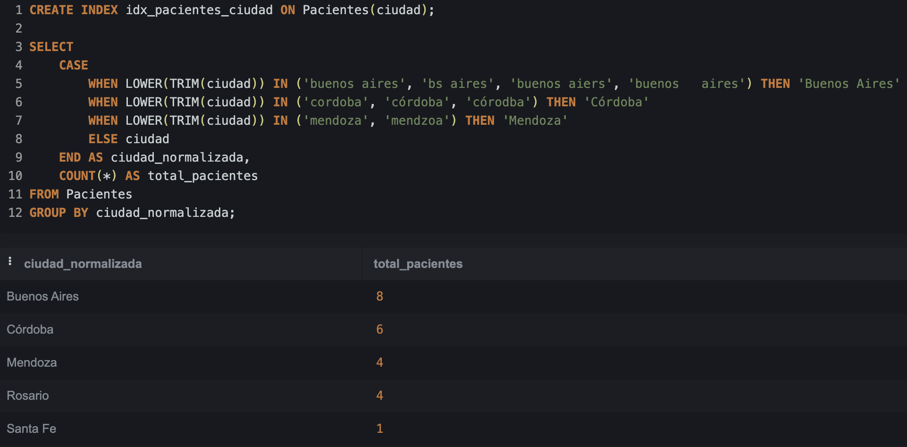

2. Se tiene la fecha de nacimiento de los pacientes. Se desea calcular la edad de los pacientes y almacenarla de forma dinámica en el sistema ya que es un valor típicamente consultado, junto con otra información relevante del paciente.

```
SELECT nombre, fecha_nacimiento,
       (strftime('%Y', 'now') - strftime('%Y', fecha_nacimiento)) 
       - (strftime('%m-%d', 'now') < strftime('%m-%d', fecha_nacimiento)) AS edad
FROM Pacientes;
```
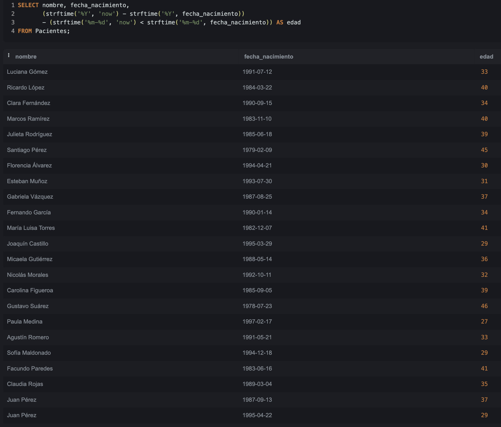

3. La paciente, “Luciana Gómez”, ha cambiado de dirección. Antes vivía en “Avenida Las Heras 121” en “Buenos Aires”, pero ahora vive en “Calle Corrientes 500” en “Buenos Aires”. Actualizar la dirección de este paciente en la base de datos.

```
UPDATE Pacientes
SET calle = 'Calle Corrientes', numero = '500'
WHERE nombre = 'Luciana Gómez' AND ciudad = 'Bs Aires' AND calle = 'Avenida Las Heras' AND numero = '121';
```
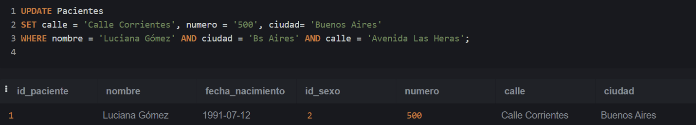

4. Seleccionar el nombre y la matrícula de cada médico cuya especialidad sea identificada por el id 4.

```
SELECT nombre, matricula
FROM Medicos
WHERE especialidad_id = 4;
```
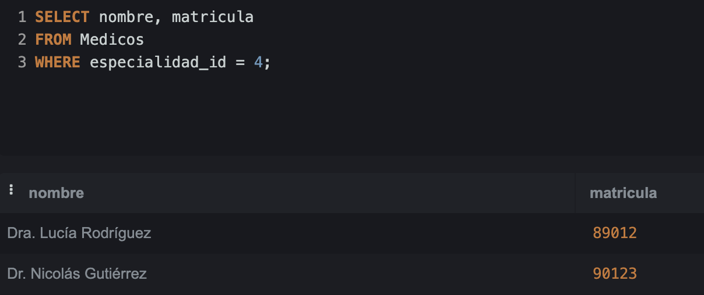

5. Puede pasar que haya inconsistencias en la forma en la que están escritos los nombres de las ciudades, ¿cómo se corrige esto? Agregar la query correspondiente.

```
UPDATE Pacientes SET ciudad = 'Buenos Aires' WHERE TRIM(LOWER(ciudad)) IN ('buenos aires', 'buenos   aires', 'bs aires', '  buenos aires', 'buenos aires ');
UPDATE Pacientes SET ciudad = 'Córdoba' WHERE TRIM(LOWER(ciudad)) IN ('cordoba', 'córdoba', 'córodba');
UPDATE Pacientes SET ciudad = 'Mendoza' WHERE TRIM(LOWER(ciudad)) IN ('mendoza', 'mendzoa');
```
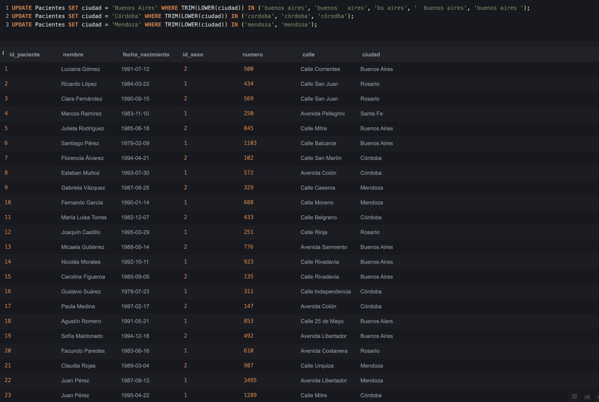

6. Obtener el nombre y la dirección de los pacientes que viven en Buenos Aires.

```
SELECT nombre, CONCAT(numero, ' ', calle) AS direccion
FROM Pacientes
WHERE TRIM(LOWER(ciudad)) = 'buenos aires';
```
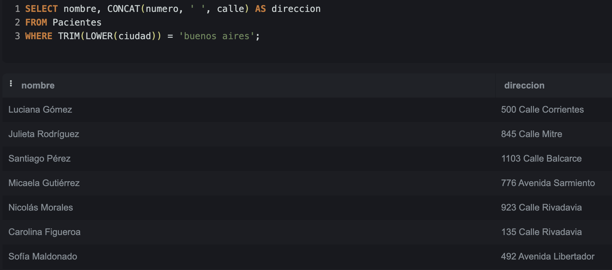

7. Cantidad de pacientes que viven en cada ciudad.

```
SELECT ciudad, COUNT(*) AS cantidad_pacientes
FROM Pacientes
GROUP BY ciudad;
```
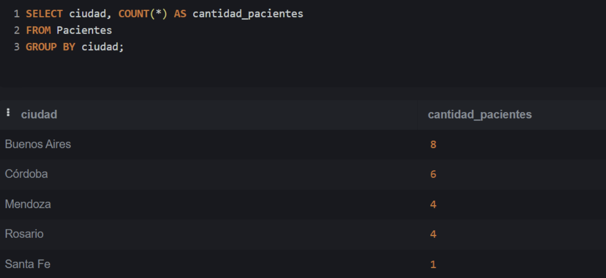

8. Cantidad de pacientes por sexo que viven en cada ciudad.

```
SELECT p.ciudad, s.descripcion AS sexo, COUNT(*) AS cantidad_pacientes
FROM Pacientes p
JOIN SexoBiologico s ON p.id_sexo = s.id_sexo
GROUP BY p.ciudad, s.descripcion;
```
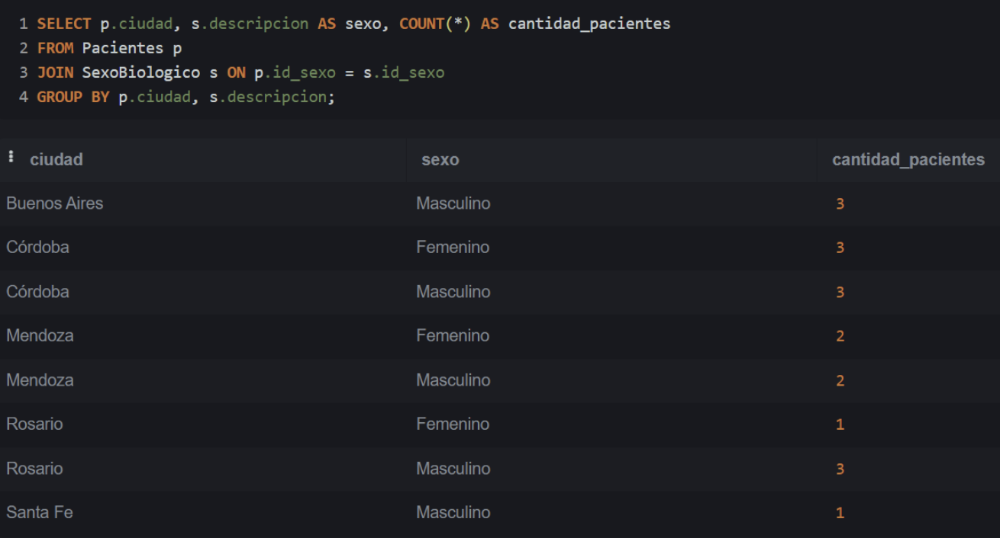

9. Obtener la cantidad de recetas emitidas por cada médico.

```
SELECT m.nombre AS nombre_medico, 
COUNT(r.id_receta) AS cantidad_recetas
FROM Recetas r
JOIN Medicos m ON r.id_medico = m.id_medico
GROUP BY r.id_medico;
```
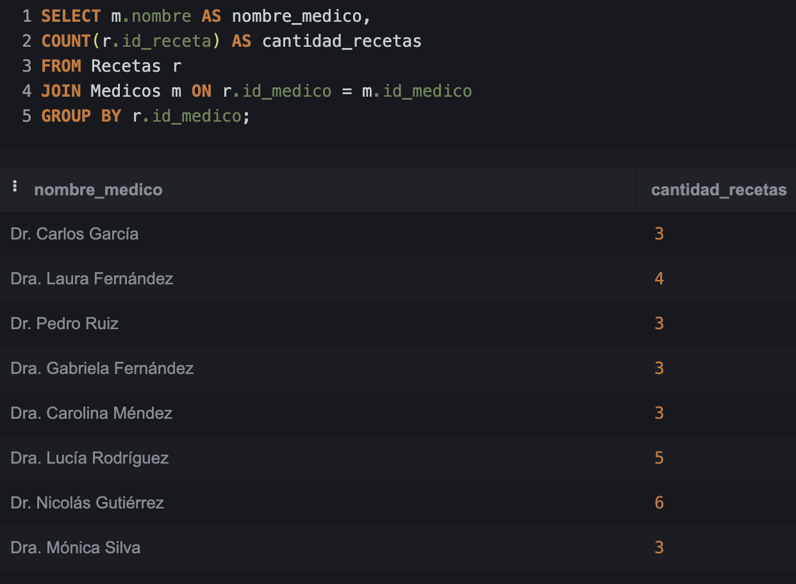

10. Obtener todas las consultas médicas realizadas por el médico con ID igual a 3 durante el mes de agosto de 2024.

```
SELECT  c.id_consulta,  p.nombre AS nombre_paciente, c.fecha, c.diagnostico, c.tratamiento
FROM  Consultas c
JOIN Pacientes p ON c.id_paciente = p.id_paciente WHERE c.id_medico = 3 AND c.fecha BETWEEN '2024-08-01' AND '2024-08-31';
```
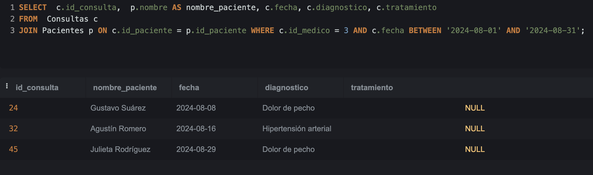

11. Obtener el nombre de los pacientes junto con la fecha y el diagnóstico de todas las consultas médicas realizadas en agosto del 2024.

```
SELECT  p.nombre AS nombre_paciente, c.fecha, c.diagnostico
FROM Consultas c JOIN Pacientes p ON c.id_paciente = p.id_paciente WHERE  c.fecha BETWEEN '2024-08-01' AND '2024-08-31';
```


12. Obtener el nombre de los medicamentos prescritos más de una vez por el médico con ID igual a 2.

```
SELECT m.nombre AS nombre_medicamento,
COUNT(r.id_receta) AS cantidad_prescripciones
FROM Recetas r JOIN Medicamentos m ON r.id_medicamento = m.id_medicamento WHERE r.id_medico = 2
GROUP BY m.nombre
HAVING 
    COUNT(r.id_receta) > 1;
```
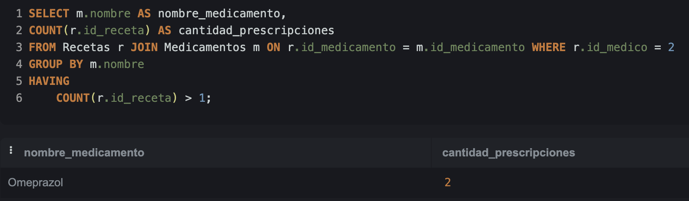

13. Obtener el nombre de los pacientes junto con la cantidad total de recetas que han recibido.

```
SELECT p.nombre AS nombre_paciente, COUNT(r.id_receta) AS cantidad_recetas
FROM Pacientes p
LEFT JOIN Recetas r ON p.id_paciente = r.id_paciente
GROUP BY p.id_paciente;
```
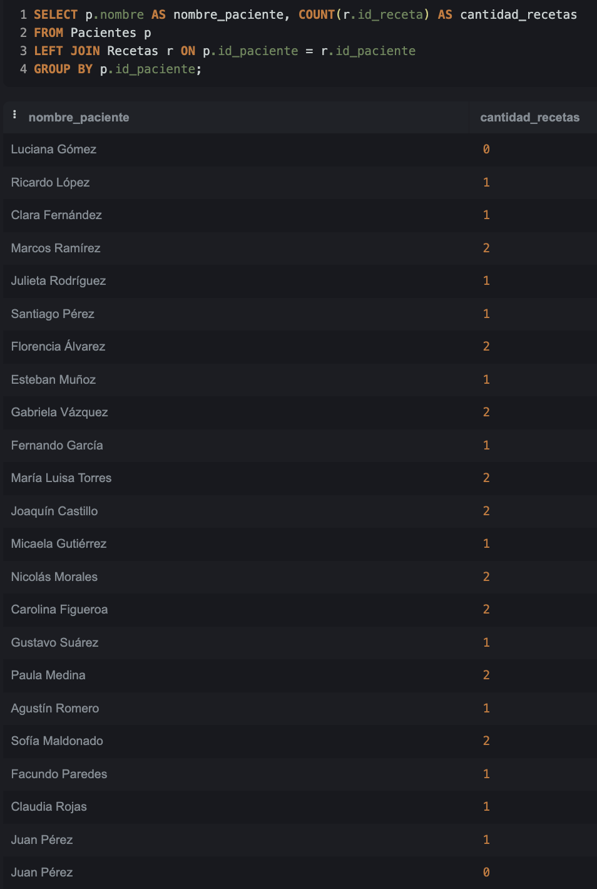

14. Obtener el nombre del medicamento más recetado junto con la cantidad de recetas emitidas para ese medicamento.

```
SELECT m.nombre AS nombre_medicamento, COUNT(r.id_receta) AS cantidad_recetas
FROM Medicamentos m JOIN Recetas r ON m.id_medicamento = r.id_medicamento
GROUP BY m.id_medicamento
ORDER BY cantidad_recetas DESC
LIMIT 1;
```
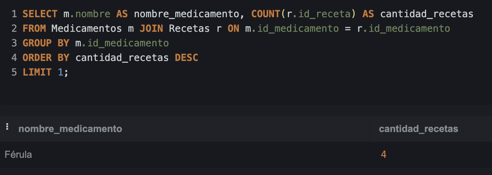

15. Obtener el nombre del paciente junto con la fecha de su última consulta y el diagnóstico asociado.

```
SELECT p.nombre AS NombrePaciente, 
       c.fecha AS FechaUltimaConsulta, 
       c.diagnostico AS Diagnostico
FROM Pacientes p
LEFT JOIN Consultas c ON p.id_paciente = c.id_paciente
WHERE c.fecha = (SELECT MAX(fecha) 
                 FROM Consultas 
                 WHERE id_paciente = p.id_paciente);
```
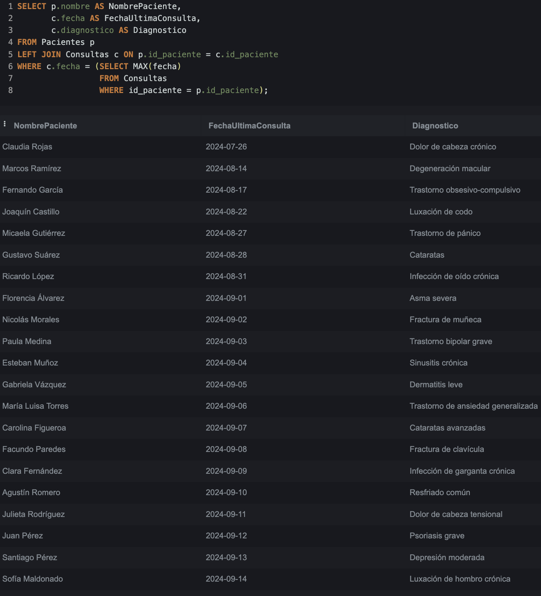

16. Obtener el nombre del médico junto con el nombre del paciente y el número total de consultas realizadas por cada médico para cada paciente, ordenado por médico y paciente.

```
SELECT 
    m.nombre AS NombreMedico, p.nombre AS NombrePaciente, 
 COUNT(c.id_consulta) AS TotalConsultas

FROM 
    Medicos m
JOIN 
    Consultas c ON m.id_medico = c.id_medico
JOIN 
    Pacientes p ON c.id_paciente = p.id_paciente
GROUP BY 
    m.id_medico, p.id_paciente
ORDER BY 
    m.nombre, p.nombre;
```
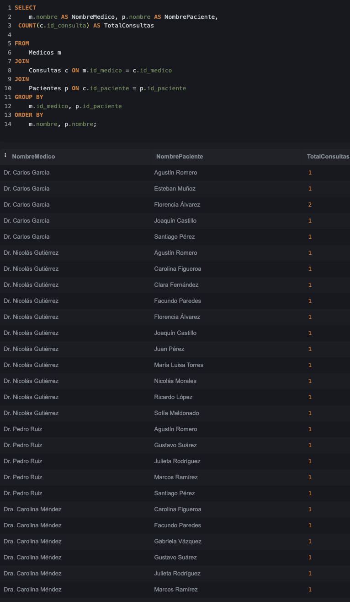

17. Obtener el nombre del medicamento junto con el total de recetas prescritas para ese medicamento, el nombre del médico que lo recetó y el nombre del paciente al que se le recetó, ordenado por total de recetas en orden descendente.

```
SELECT me.nombre AS NombreMedicamento, COUNT(r.id_receta) AS TotalRecetas,m.nombre AS NombreMedico,p.nombre AS NombrePaciente
FROM Medicamentos me
JOIN  Recetas r ON me.id_medicamento = r.id_medicamento
JOIN Medicos m ON r.id_medico = m.id_medico
JOIN Pacientes p ON r.id_paciente = p.id_paciente
GROUP BY me.id_medicamento, m.id_medico, p.id_paciente
ORDER BY TotalRecetas DESC;
```
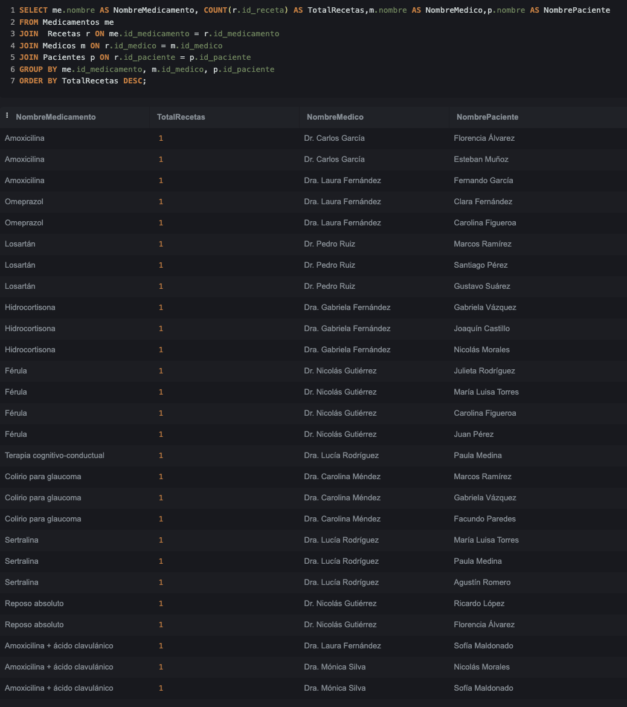

18. Obtener el nombre del médico junto con el total de pacientes a los que ha atendido, ordenado por el total de pacientes en orden descendente.

```
SELECT m.nombre AS nombre_medico, COUNT(c.id_paciente) AS total_pacientes
FROM Medicos m
JOIN Consultas c ON m.id_medico = c.id_medico
GROUP BY m.id_medico, m.nombre
ORDER BY total_pacientes DESC;
```
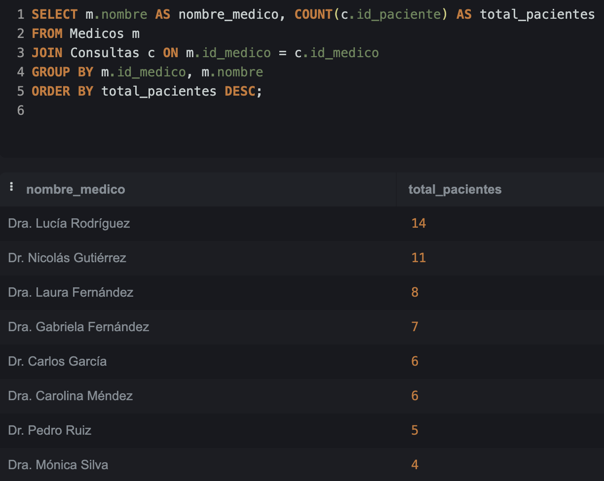
