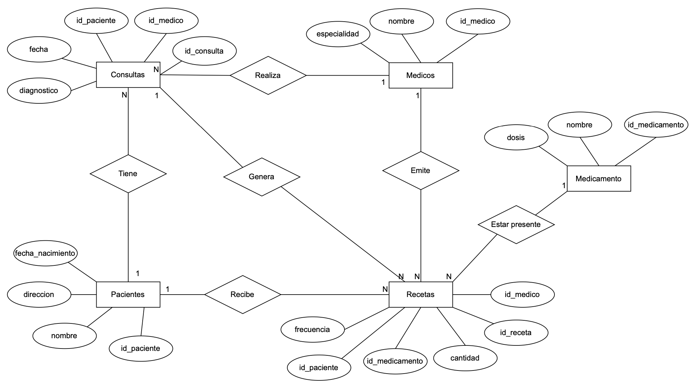

# Parte 1 - Bases de Datos

Utilizando la base de datos de un centro médico que utilizamos a lo largo de las clases y la información brindada por el enunciado (la cual se muestra a continuación), se procedió a resolver las consignas.

### Entidades: 
- **Pacientes**: Registra información detallada sobre los pacientes, incluyendo nombre, fecha de nacimiento y dirección.
- **Médicos**: Almacena detalles sobre los médicos que brindan atención médica, como nombre y especialidad.
- **Medicamentos**: Contiene una lista de medicamentos disponibles con detalles sobre dosis y administración.
- **Consultas**: Registra todas las consultas médicas realizadas, incluyendo fecha, médico y paciente involucrados, y diagnóstico.
- **Recetas**: Vincula pacientes con medicamentos prescritos por los médicos, incluyendo información sobre el medicamento, cantidad y frecuencia.

### Consignas:

1. **¿Qué tipo de base de datos es? Clasificarla según estructura y función.**

La base de datos del centro médico puede clasificarse como una base de datos relacional, ya que se usan tablas relacionadas entre sí mediante claves primarias (_primary keys o PK_) y claves foráneas (_foreign keys o FK_) para almacenar datos de diferentes entidades como pacientes, médicos, recetas, medicamentos y consultas. En cuanto a la función, el principal objetivo es gestionar transacciones en tiempo real, como el registro de consultas, la emisión de recetas y la actualización de datos de pacientes y médicos.

2. **Armar el diagrama entidad-relación de la base de datos dada.**

A continuación presentamos las entidades con sus atributos y relaciones:

- **Pacientes**
  - `id_paciente` (PK)
  - `nombre`
  - `fecha_nacimiento`
  - `dirección`

- **Médicos**
  - `id_médico` (PK)
  - `nombre`
  - `especialidad`

- **Medicamentos**
  - `id_medicamento` (PK)
  - `nombre`
  - `dosis`

- **Consultas**
  - `id_consulta` (PK)
  - `fecha`
  - `diagnostico`
  - `id_médico` (FK)
  - `id_paciente` (FK)

- **Recetas**
  - `id_receta` (PK)
  - `cantidad`
  - `frecuencia`
  - `id_paciente` (FK)
  - `id_médico` (FK)
  - `id_medicamento` (FK)

**Relaciones:**
- Una consulta está vinculada a un solo paciente, pero un paciente puede tener muchas consultas. Relación 1 a muchos (N).
- Una receta está vinculada a un solo paciente, pero un paciente puede recibir muchas recetas. Relación 1 a muchos (N).
- Una consulta está vinculada a un solo médico, pero un médico puede realizar muchas consultas. Relación 1 a muchos (N).
- Una receta está vinculada a un solo médico, pero un médico puede emitir muchas recetas. Relación 1 a muchos (N).
- Una receta contiene un solo medicamento, pero un medicamento puede estar presente en muchas recetas. Relación 1 a muchos (N).
- Una consulta médica puede generar varias recetas, pero cada receta está vinculada a una sola consulta. Relación 1 a muchos (N).

A partir de la definición de las entidades con sus atributos y las relaciones que mencionamos anteriormente armamos el diagrama entidad-relación que se puede ver a continuación:

3. **Armar el Modelo relacional de la base de datos dada.**

En base a las entidades y relaciones del ítem pasado, armamos el modelo relacional de la base de datos.

> El modelo relacional se incluye a continuación:

4. **¿Considera que la base de datos está normalizada? En caso que no lo esté, ¿cómo podría hacerlo?**

La normalización es el proceso de estructurar una base de datos de acuerdo con una serie de reglas para minimizar la redundancia de datos y mejorar la integridad de los datos. Dada la base proporcionada, se puede observar que cada tabla tiene una clave primaria única, y todas las columnas no clave dependen directamente de la clave primaria. No hay dependencias transitivas visibles. Por lo tanto, se considera que no se requiere ninguna normalización adicional.
